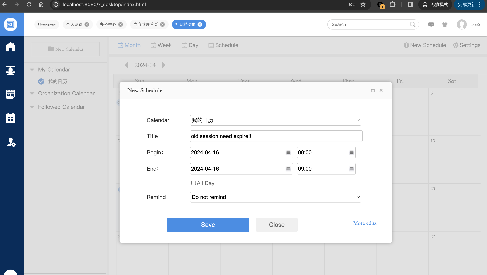

## TYPE: Insufficient Session Expiration(CWE-613)

## Date: 4/14/2024
## Product Information
### Vendor: [o2oa](https://github.com/mindskip)
### Homepage: https://github.com/o2oa/o2oa
**version**: 
9.0.3(Apr 3, 2024 )

## Tested on: Debian Linux, Mysql

## Exploit Description
Suffering from CWE613-Insufficient Session Expiration.
Have not expire user session after user changing his password or admin reset his password.
### PoC1
1. `admin` login
2. `user1` login
3. `admin` reset password of `user1`
   
4. `user1` is not forced log out, and can still do anything like modify his information.

### POC2
1. `user1` login
2. `user1` change his password

3. `user1` can still operate any thing

