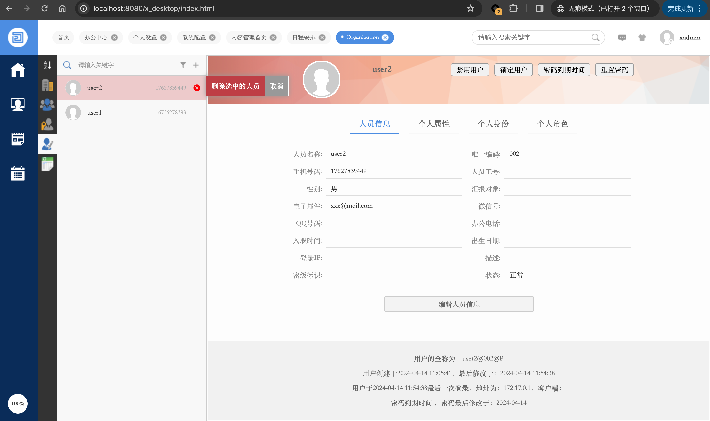
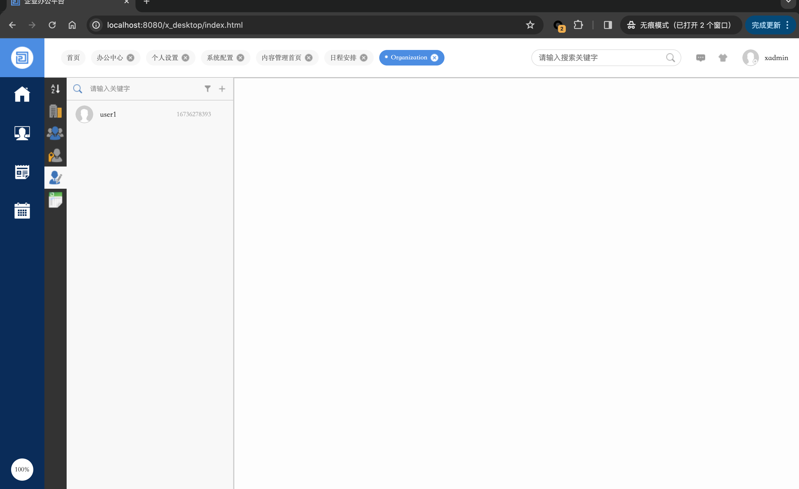
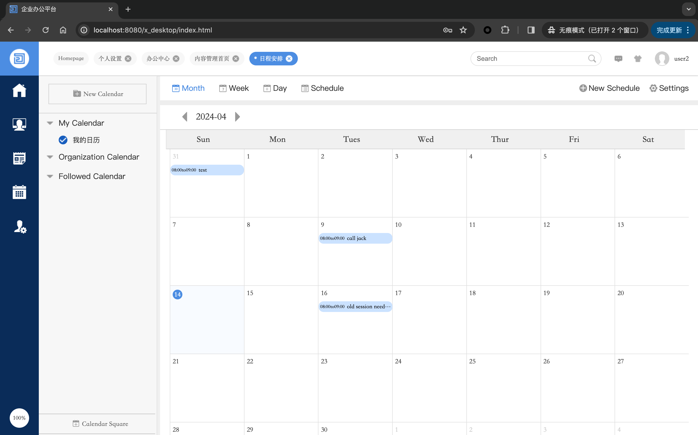
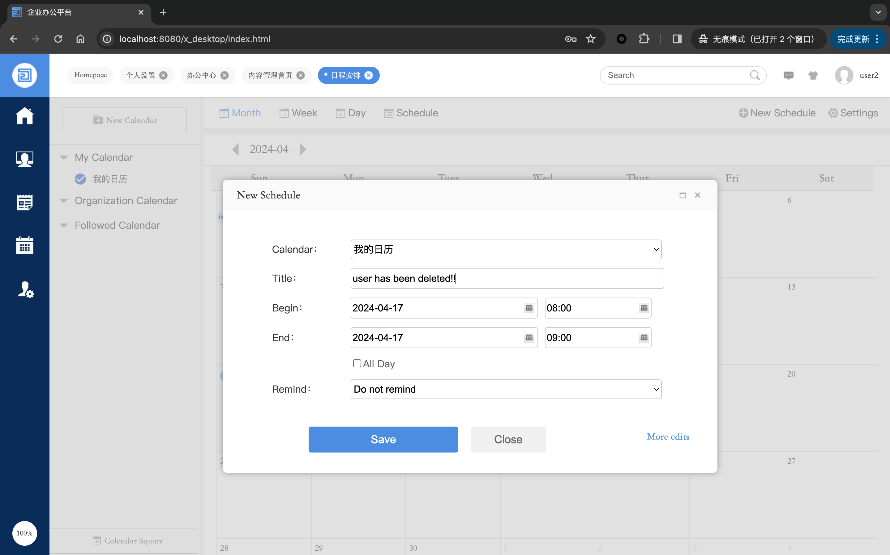
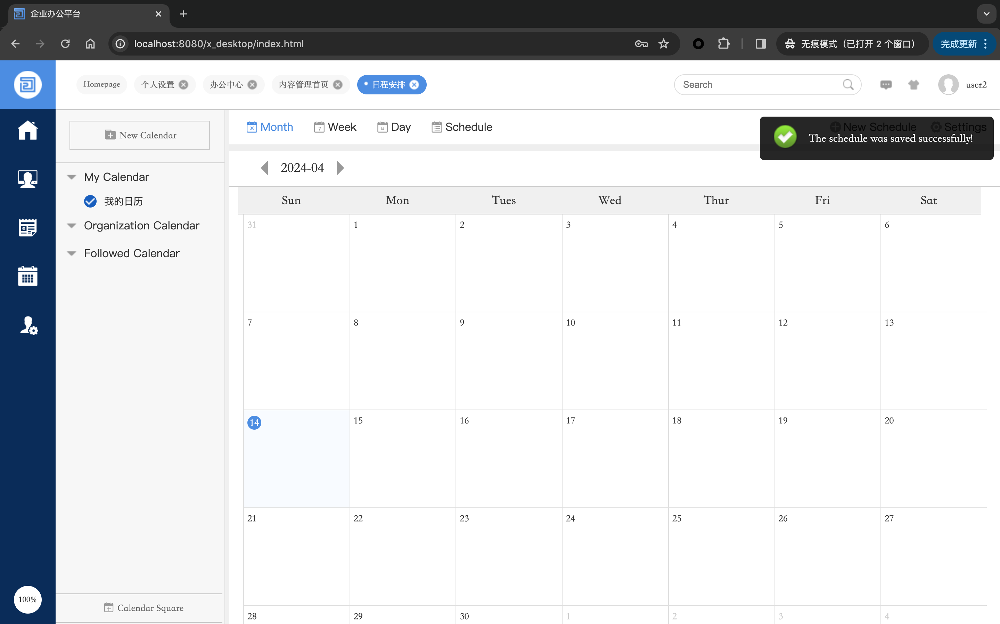

## TYPE: Insufficient Session Expiration(CWE-613)

## Date: 4/14/2024
## Product Information
### Vendor: [o2oa](https://github.com/mindskip)
### Homepage: https://github.com/o2oa/o2oa
**version**: 
9.0.3(Apr 3, 2024 )

## Tested on: Debian Linux, Mysql

## Exploit Description
Suffering from CWE613-Insufficient Session Expiration.
User can still operate even after being deleted by admin.

## POC
1. `admin` login
2. `user2` login
3. `admin` delete `user2`

4. `user2` can still do anything without logging out

